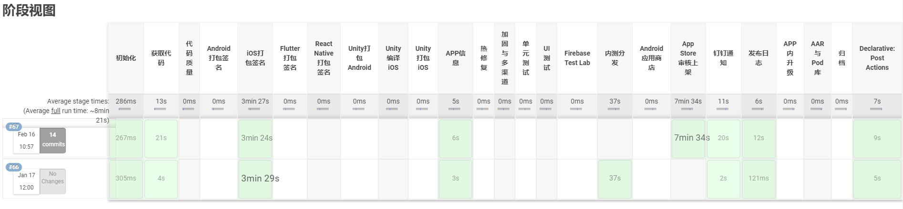
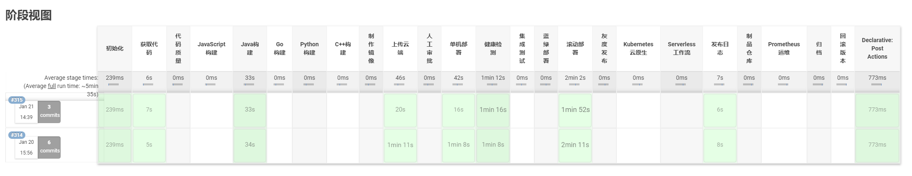
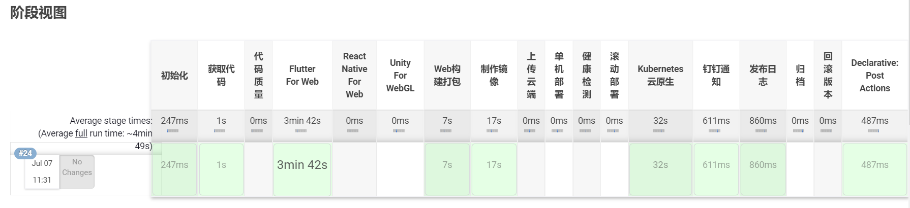

English | [简体中文](./README.md)

# One For All DevOps MonoRepo

## The original intention of open source: take from open source, give back to open source, give roses to others, and leave fragrance in hand
### Welcome everyone to PR to build an ecosystem. The pipelines at each end have passed tens of thousands of enterprise-level construction tests

### Vision All In One Powerful, flexible, easy-to-use, cross-end

Design a general and fully automated DevOps to improve the efficiency and quality of product delivery, truly improve the quality and efficiency of each end, and ultimately improve the user experience to achieve the best balance between DX and UX.

- Provide developers with a pleasant development experience, allowing developers to focus on creative and interesting work, and hand over repetitive work to the machine.
- Provide users with an excellent user experience and ensure the stable development of high-quality and high-quality products in order to create greater value.
- Continuous iterative maintenance is the foundation and advantage of this project, which makes the software have endless vitality.

### Cross-end CI/CD shared library pipeline legend

- APP native Android, iOS, Flutter, React Native, Unity technology
  
- Server-side Java, Go, Python, C++ and other multi-language projects
  
- Mini Program Technology Type 1. Native Mini Program 2. Taro Cross-End Mini Program 3. uni-app Cross-End Mini Program 4. mpvue Cross-End Mini Program 5. Remax Cross-End Mini Program
  
- Desktop client Electron, Unity (Windows, MacOS, Linux)
  
- Web Technology Project Type 1. Npm Ecology and Static Web Project 2. Flutter For Web 3. React Native For Web 4. Unity For Web 5. WebAssembly
  
- IoT Project 1. Embedded 2. VR AR XR 3. MetaVerse
  

### Supported range of multi-terminal CI/CD shared library pipeline based on Jenkins Pipeline shared library implementation

- Mobile: Android, iOS, Flutter, React Native
- Applets: native and cross-end applet
- Large front-end: JavaScript language: static web and multi-version Node mainstream frameworks and mainstream cross-platform frameworks
- Server: Multi-version Java, Go, Python, C++
- Desktop: Electron, Unity (Windows, MacOS, Linux)
- IoT: Embedded (PlatformIO, Arduino)
- Visual Engine: Unity, WebGL, Cocos
- Warehouse method: Single warehouse multi-package MonoRepo, multi-warehouse single package MultiRepo
- Deployment method: stand-alone deployment, mirror warehouse, blue-green deployment, rolling deployment, distributed deployment, K8S cluster automatic scaling, one-click rollback, automatic review and listing, springboard transparent transmission deployment, etc.
- App Market: App Store, Mini Program Platform, Huawei Store, Xiaomi Store, Self-built OSS, Firebase, Dandelion, Fir, etc.
- Notification types: Post results, Post logs, Audit status, etc.
- CI/CD operating system: MacOS, Linux

### Jenkins Pipeline shared library code

- Shared core Pipeline code is easier to iterate and maintain as projects grow
- Differential items are handled through different shared libraries or dynamic parameters

### Project Directory

- .ci directory Container deployment related scripts and configurations
- pipelines directory pipeline configuration file entry
- resources directory Non-Groovy file storage Load arbitrary files through the libraryResource step in the external library The file will be loaded as a string
- src directory Pipeline pipeline general class, tool class and constant encapsulation
- vars directory to share core Pipeline workflows and documentation on different sides
- Jenkinsfile.x file is the basic variable configuration file for different projects in different environments

### Pipeline core technology

- Jenkins Pipeline, Groovy、Python
- Kubernetes、Docker, Shell, Node, C#, Playwright
- Fastlane, Ruby

### Core contributors

- Pan Weiji