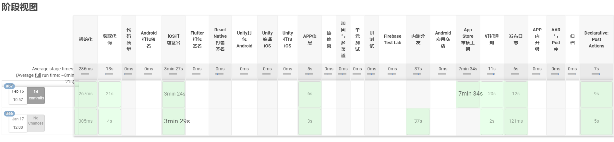
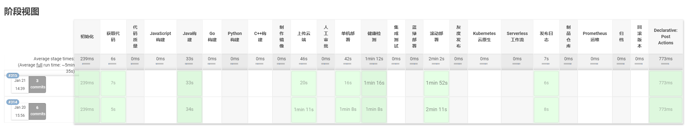
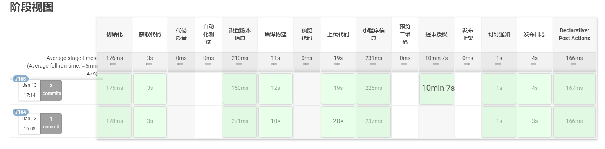
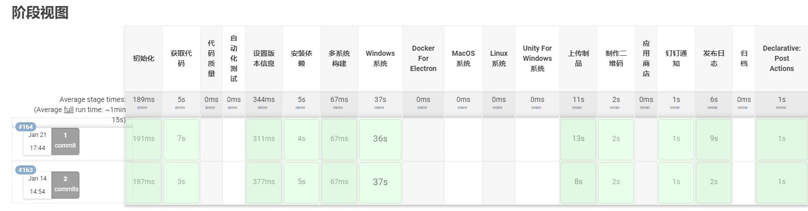
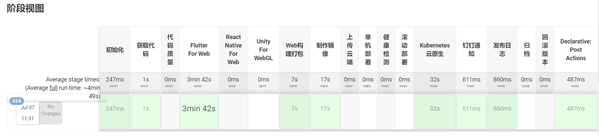
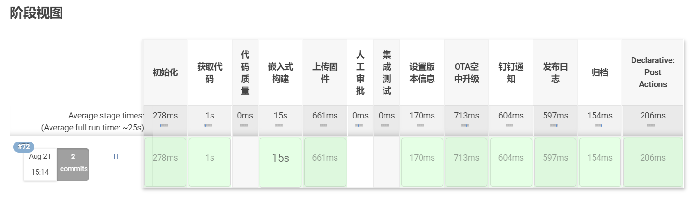

简体中文 | [English](./README.en.md)  
[文档](https://deepwiki.com/DreamPWJ/jenkins-shared-library?lang=zh-CN)

# One For All DevOps MonoRepo

## 开源的初衷: 取之开源、回馈开源、赠人玫瑰、手留余香
### 欢迎大家PR共建生态 各端流水线已经过几万次的企业级构建考验

### 愿景 All In One 强大、灵活、易用、跨端

设计一个通用全自动化的DevOps, 提高产品交付效率和质量, 真正做到各端质效提升, 最终提升用户体验, 达到DX和UX的最佳平衡 。

- 为开发者提供愉悦的开发体验, 让开发者专注于创造性、趣味性的工作, 重复性的工作交全部交给机器 。
- 为使用者提供优良的用户体验, 保障产品高质高量的稳定发展, 才能创造更大的价值 。
- 持续迭代维护是本项目的根基和优势所在, 让本软件拥有生生不息的生命力 。

### 跨端CI/CD共享库流水线图例

- APP原生Android、iOS、Flutter、React Native、Unity 技术
  
- 服务端Java、Go、Python、C++等多语言项目
  
- 小程序技术类型 1. 原生小程序 2. Taro跨端小程序 3. uni-app跨端小程序 4. mpvue跨端小程序 5. Remax跨端小程序
  
- 桌面客户端 Electron、Unity(Windows、MacOS、Linux)
  
- Web技术项目类型 1. Npm生态与静态Web项目、SSR 2. Flutter For Web 3. React Native For Web 4. Unity For Web 5. WebAssembly
  
- IoT物联网项目类型  1. 嵌入式  2. VR AR XR  3. 元宇宙
  

### 多端CI/CD共享库流水线已支持的范围 基于Jenkins Pipeline共享库实现

- 移动端: Android、iOS、Flutter、React Native
- 小程序: 原生与跨端小程序
- 大前端: JavaScript语言: 静态Web与多版本Node主流框架以及主流跨平台框架
- 服务端: 多版本Java语言、Go语言、Python语言、C++语言
- 桌面端: Electron、Unity  (Windows、MacOS、Linux)
- IoT物联网端: 嵌入式(PlatformIO、Arduino)
- 视觉引擎: Unity、WebGL、Cocos
- 仓库方式: 单仓多包式MonoRepo、多仓单包式MultiRepo
- 部署方式: 单机部署、镜像仓库、蓝绿部署、滚动部署、分布式部署、K8S集群自动扩缩容、一键回滚、自动提审上架、跳板机透传部署等
- 应用市场: App Store、小程序平台、华为商店、小米商店、自建OSS、Firebase、蒲公英、Fir等
- 通知类型: 发布结果、发布日志、审核状态等
- CI/CD运行系统: MacOS、Linux

### Jenkins Pipeline共享库代码

- 随着项目不断增多 共享核心Pipeline代码更易于迭代和维护
- 差异性项目通过不同的共享库或动态参数处理

### 工程目录

- .ci目录 容器部署相关脚本和配置
- pipelines目录 流水线配置文件入口
- resources目录 非Groovy文件存储 通过外部库中的libraryResource步骤加载任意文件 文件会当做字符串加载
- src目录 Pipeline流水线通用类、工具类和常量等封装
- vars目录 不同端共享核心Pipeline工作流和文档
- Jenkinsfile.x 文件是不同环境不同项目的基础变量配置文件

### 流水线核心技术

- Jenkins Pipeline、Groovy、Python
- Kubernetes、Docker、Shell、Node、C#、Playwright
- Fastlane、Ruby

### 核心贡献者

- 潘维吉
