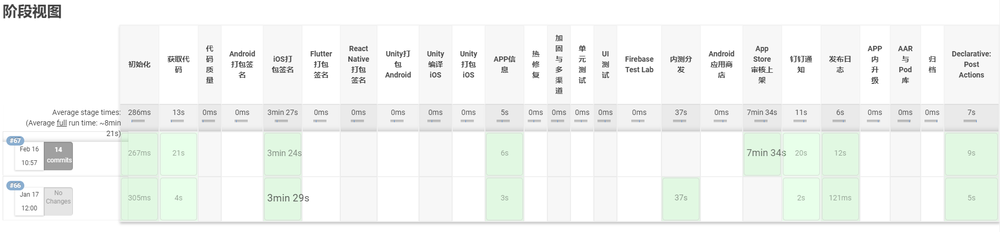
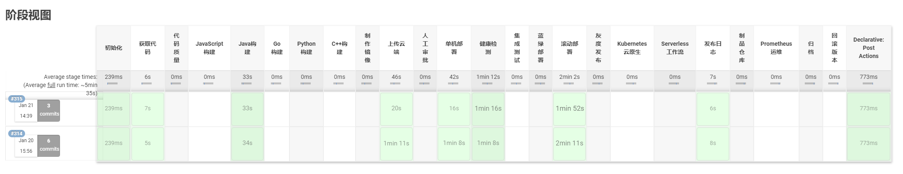
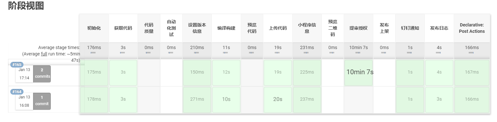
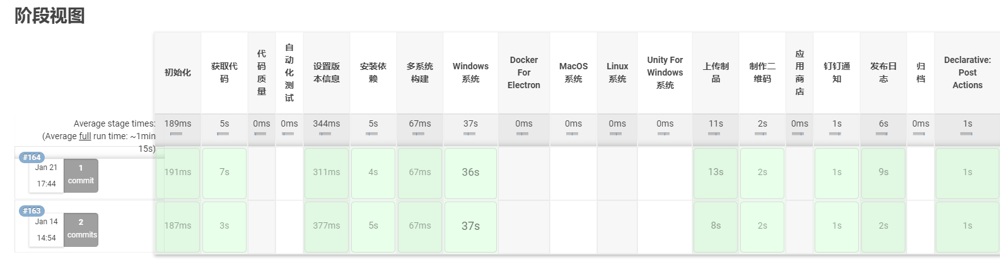
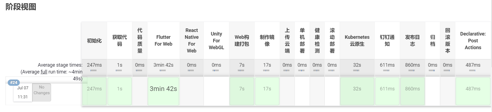
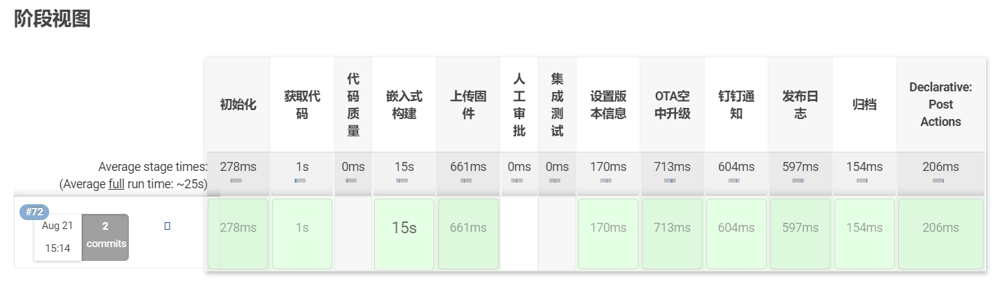

<div align="center">

# One For All DevOps MonoRepo

[简体中文](./README.md) | [English](./README.en.md)

[](LICENSE)
[](https://jenkins.io/)
[]()
[](https://kubernetes.io/)
[](https://docker.com/)

[📖 在线文档](https://deepwiki.com/DreamPWJ/jenkins-shared-library?lang=zh-CN)

**强大 · 灵活 · 易用 · 跨端 的一站式 DevOps 解决方案**

</div>

---

## 🎯 开源初衷

> **取之开源、回馈开源、赠人玫瑰、手留余香**
>
> 欢迎大家 PR 共建生态，各端流水线已经过 **几万次** 企业级构建考验

### 愿景：All In One

设计一个通用全自动化的 DevOps 系统，提高产品交付效率和质量，真正做到各端质效提升，最终提升用户体验，达到 **DX** 和 **UX** 的最佳平衡。

- 🧑‍💻 **开发者体验** - 让开发者专注于创造性、趣味性的工作，重复性的工作全部交给机器
- 👤 **用户体验** - 保障产品高质高量的稳定发展，创造更大价值
- 🔄 **持续迭代** - 持续迭代维护是本项目的根基和优势所在，让软件拥有生生不息的生命力

---

## 📱 支持的流水线类型

<div align="center">

| 类型 | 技术栈 | 示意图 |
|:---:|:---|:---:|
| **📱 APP** | Android、iOS、Flutter、React Native、Unity |  |
| **🖥️ 服务端** | Java、Go、Python、C++ 等多语言项目 |  |
| **💡 小程序** | 原生、Taro、uni-app、mpvue、Remax |  |
| **🖥️ 桌面端** | Electron、Unity (Windows、MacOS、Linux) |  |
| **🌐 Web** | Npm 生态、静态 Web、SSR、Flutter/React Native/Unity For Web、WebAssembly |  |
| **🔗 IoT** | 嵌入式、VR/AR/XR、元宇宙 |  |

</div>

---

## ✨ 功能特性

### 已支持的平台

| 平台 | 技术栈 |
|:---|:---|
| 📱 **移动端** | Android、iOS、Flutter、React Native |
| 💡 **小程序** | 原生小程序、跨端小程序 |
| 🖥️ **大前端** | JavaScript 静态 Web、多版本 Node、主流框架、跨平台框架 |
| ⚙️ **服务端** | 多版本 Java、Go、Python、C++ |
| 🖥️ **桌面端** | Electron、Unity (Windows、MacOS、Linux) |
| 🔗 **IoT** | 嵌入式 (PlatformIO、Arduino) |
| 🎮 **视觉引擎** | Unity、WebGL、Cocos |

### 仓库与部署

| 类别 | 支持内容 |
|:---|:---|
| **仓库方式** | MonoRepo (单仓多包)、MultiRepo (多仓单包) |
| **部署方式** | 单机部署、镜像仓库、蓝绿部署、滚动部署、分布式部署、K8S 集群自动扩缩容、一键回滚、自动提审上架、跳板机透传部署 |
| **应用市场** | App Store、小程序平台、华为商店、小米商店、自建 OSS、Firebase、蒲公英、Fir |
| **通知类型** | 发布结果、发布日志、审核状态 |
| **运行系统** | MacOS、Linux |

---

## 🏗️ 工程目录

```
jenkins-shared-library/
├── .ci/                    # 容器部署相关脚本和配置
├── pipelines/              # 流水线配置文件入口
├── resources/              # 非 Groovy 文件存储 (通过 libraryResource 加载)
├── src/                    # Pipeline 通用类、工具类和常量封装
├── vars/                   # 各端共享核心 Pipeline 工作流和文档
├── docs/                   # 文档资料
├── _jenkins/               # Jenkins 相关配置
├── _docker/                # Docker 相关配置
├── _k8s/                   # Kubernetes 相关配置
├── _linux/                 # Linux 相关脚本和配置
├── _nginx/                 # Nginx 相关配置
├── _database/              # 数据库相关配置
├── Jenkinsfile.*           # 不同环境/项目的基础变量配置文件
└── README.md               # 项目说明文档
```

---

## 🔧 技术栈

| 类别 | 技术 |
|:---|:---|
| **核心** | Jenkins Pipeline、Groovy、Python |
| **容器** | Kubernetes、Docker、Shell |
| **移动端** | Fastlane、Ruby |
| **前端** | Node.js、Playwright、C# |

---

## 📖 使用指南

### 快速开始

> 详细文档请参考 [在线文档](https://deepwiki.com/DreamPWJ/jenkins-shared-library?lang=zh-CN)

### 核心概念

- **Pipeline 共享库** - 可在 Jenkins 中通过 `@Library('my-shared-library')` 引入
- **动态库加载** - `library('my-shared-library').shared.library.Utils.getVersionNum()` 方式引入
- **第三方依赖** - 支持 `@Grab` 注解使用第三方库

### 调试技巧

- 使用 Jenkins 自带的 **回放** 功能进行调试，减少代码频繁提交

---

## 🤝 贡献指南

我们欢迎各种形式的贡献：

- 🐛 提交 Bug 报告
- 💡 提出功能建议
- 📝 改进文档
- 🔀 提交 PR 修复问题或添加新功能

---

## 👥 核心贡献者

- **潘维吉** (Pan WeiJi) - 项目作者

---

## 📄 许可证

本项目采用 [MIT](LICENSE) 协议开源

---

<div align="center">

**⭐ 如果这个项目对你有帮助，请给一个 Star 支持！**

</div>